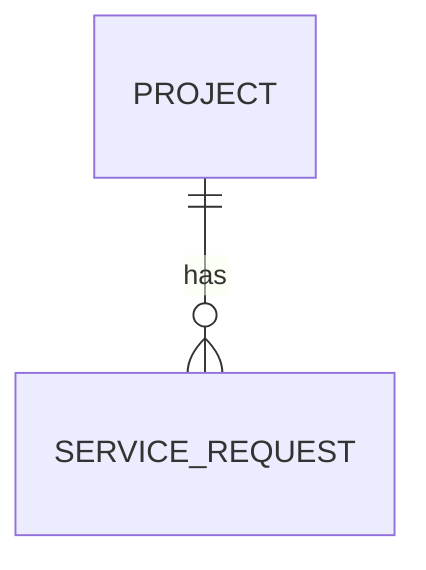
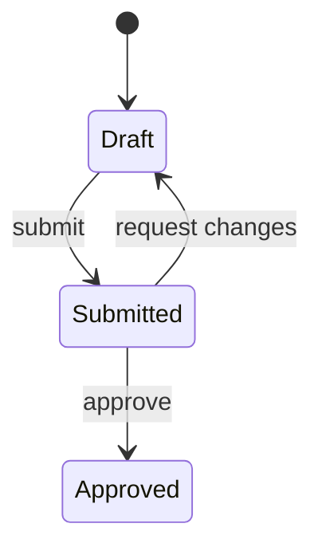

# Decision register artifact template

Skills that distil a research lake into proposed decisions use this body
structure. Populate every `[placeholder]`. Entry blocks repeat as needed.

For `git`/`obsidian` backends, prepend YAML frontmatter with every required
schema field (see `_thoughts/required-metadata.md`). For `notion`/`anytype`,
schema fields ride as typed properties, so do NOT duplicate them in the body.

The schema `type` is `plan`. A register of proposed decisions is a plan, which
is honest and needs no schema change. `status` is `draft` while it circulates
and `active` once the open questions are answered and someone owns the result.

Unlike an implementation plan, **this artifact is saved with its open questions
intact.** They are the deliverable, not a defect. Do not resolve them to make
the document look finished.

**Every section here is subject to `lake-provenance.md`'s build test.** An entry
earns its place by naming the artefact it changes, or by bounding an entry that
does. Sections come out empty rather than padded, and an empty section is
information. A register that reads as a summary of the research has failed even
where every line in it is true.

````markdown
# [Subject] Decision Register

## Data model

[Only what becomes a schema. Entities, how they relate, and the states each one
moves through. Not a glossary and not a persona list: if a noun does not become a
table, a type or a route, it does not belong here.]

### Relationships

[Entity to entity, one line each, each with a locator. **This table is the
citable form.** The diagram below is a view of it and adds nothing.]

| From | To | Cardinality | Locator |
|---|---|---|---|
| [entity] | [entity] | [one-to-many / one-to-one / many-to-many / **unstated**] | [locator] |



**Draw only rows whose cardinality is cited.** Mermaid's `erDiagram` has no
notation for unknown cardinality: every line you draw asserts one. `||--o{` is a
claim that the relationship is exactly-one-to-zero-or-many, and if no source said
so, drawing it invents a decision the research does not support. Rows marked
**unstated** stay in the table, stay out of the diagram, and are listed underneath
it:

**Cardinality unstated, omitted from the diagram:** [From → To, and who would
know.]

### States

[Per entity that has a lifecycle: the states and the transitions, with locators.
Decks are usually the best source, because a screen is a state. Same rule: the
table is citable, the diagram is a view.]

| Entity | From | To | Trigger | Locator |
|---|---|---|---|---|



**Draw only cited transitions.** A state with no cited way out is a finding, not
a gap in the diagram: say so under it rather than inventing an edge to make the
picture look closed. An unreachable state is exactly the kind of thing this
document exists to surface.

**States with no cited exit:** [state, and what the research does not say.]

## Constraints

[Falsifiable statements only. Numbers, non-goals, named integrations,
compliance requirements. Each with a locator and, where it rests on something
unverified, an invalidation trigger.]

| # | Constraint | Locator | Invalidated if |
|---|---|---|---|

## Decisions

### D[n]: [The decision, stated as a decision]

State it as a decision, not a topic. "Requests are pull-based," never "request
handling."

**Drivers**
- [Claim] `[locator]`
- [Claim] `[locator]`

A driver with no locator is not a driver. If it has no locator it belongs in
Open Questions instead.

**Alternatives considered**
- [Alternative] - [why not, with a locator where the reason is sourced]

**Resolution**
[Either the chosen option and why, or `OPEN` with a pointer to the open question
blocking it. Never a silent guess.]

**Assumption and invalidation trigger**
[Where this rests on something unverified: what is assumed, and what would
falsify it. Omit the block only if the decision rests on nothing unverified.]

**Overruled**
[What contradicting source lost, and under which authority rule. Omit if
nothing was overruled. Never drop the loser silently.]

**Status**
[`decided` / `open - blocking` / `open - honest unknown`]

## Open questions

Every row has an owner. "Unowned" is a legal value and means someone must
assign it. Blocking questions come first.

| # | Question | Blocks | Owner | Why the lake cannot answer it |
|---|---|---|---|---|

## Prototype decisions to accept or override

[One row per architecturally significant choice found in a prototype. A
prototype made these implicitly and nobody reviewed them, so each one is a
question with a default already filled in.]

| Choice found | Locator | Accept or override | Reasoning |
|---|---|---|---|

## Governing commitments

[Every reference to a body of rules the lake does not contain: design systems,
coding standards, architecture tenets, compliance regimes, prior ADRs. Listed
whether or not a conflict was found, because each imports constraints by
reference and is the likeliest hiding place for a contradiction nobody caught.]

| # | Commitment | Locator | Content in the lake? | What it governs |
|---|---|---|---|---|

**Referenced but absent:** [the subset above whose content is NOT in the lake.
Name each one plainly. These are the documents a reader should go and fetch, and
nothing in this register has been checked against them.]

## Needs a resolution on

[Contradictions that could not be settled, and must not be. One row per conflict,
phrased as the decision somebody has to make rather than as a topic. Both sides
carry locators. An owner is required.

The common case is a specific choice against a governing commitment whose content
is absent: "all buttons should be blue" against "this follows the Acme design
system." Neither side wins, because the design system is not here to consult.
Picking one anyway is the worst available outcome, since a resolved-looking entry
stops anyone checking.]

| # | Needs a resolution on | Side A `[locator]` | Side B `[locator]` | Blocks | Owner |
|---|---|---|---|---|---|

## What this register does not cover

[Explicitly out of scope. Areas of the lake not read, subjects deliberately
deferred, technical decisions the research cannot support.]
````
